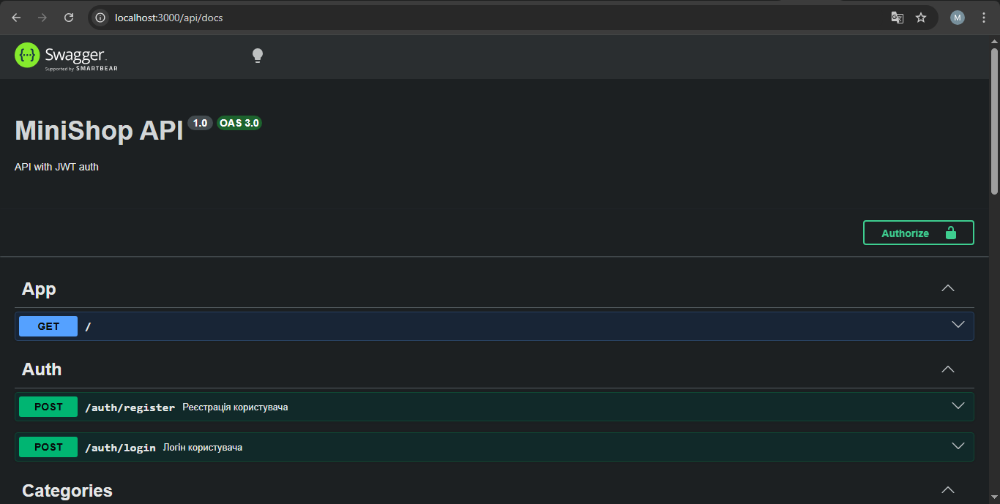
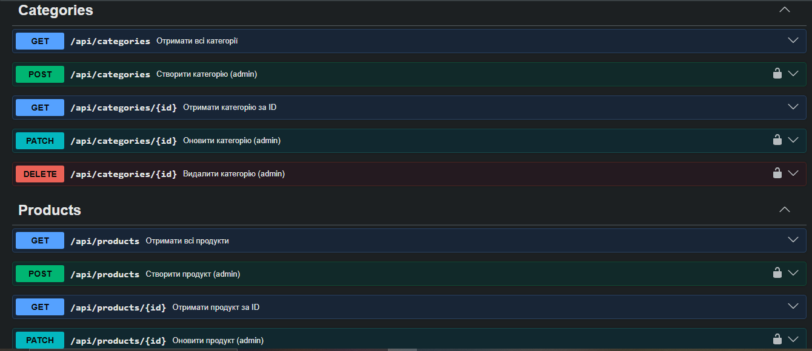

## Student

- Name: Artem Maruschyk
- Group: 232/2

## Практичне заняття №6 — Interceptors + Exception Filters + Swagger

### Структура репозиторію

```
.
├── src/
│   ├── auth/ ...
│   ├── users/ ...
│   ├── categories/ ...
│   ├── products/ ...
│   ├── common/
│   │   ├── enums/
│   │   │   └── role.enum.ts
│   │   ├── guards/
│   │   │   ├── jwt-auth.guard.ts
│   │   │   └── roles.guard.ts
│   │   ├── decorators/
│   │   │   ├── current-user.decorator.ts
│   │   │   └── roles.decorator.ts
│   │   ├── interceptors/
│   │   │   ├── logging.interceptor.ts
│   │   │   └── transform.interceptor.ts
│   │   ├── filters/
│   │   │   └── http-exception.filter.ts
│   │   └── pipes/
│   │   	└── trim.pipe.ts
│   ├── migrations/
│   ├── main.ts
│   └── app.module.ts
├── swagger-screenshot.png
├── Dockerfile
├── docker-compose.yml
└── README.md
```

### Запуск проекту

```bash
cp .env.example .env
docker compose up --build
```

### Swagger UI

http://localhost:3000/api/docs




### Формат успішної відповіді

```json
{
  "data": [
    {
      "id": 1,
      "name": "MacBook Pro",
      "description": null,
      "price": "2499.99",
      "stock": 10,
      "isActive": true,
      "category": null,
      "createdAt": "2026-04-30T14:00:19.058Z",
      "updatedAt": "2026-04-30T14:00:19.058Z"
    }
  ],
  "statusCode": 200,
  "timestamp": "2026-05-06T20:44:17.016Z"
}
```

### Формат помилки

```json
Invoke-RestMethod : {"error":{"code":404,"message":"Product #999999 not found","traceId":"c7a969d6-c912-4453-a1ac-f132f
2becfb3"},"timestamp":"2026-05-06T20:45:14.472Z"}
At line:1 char:1
+ Invoke-RestMethod -Uri "http://localhost:3000/api/products/999999" -M ...
+ ~~~~~~~~~~~~~~~~~~~~~~~~~~~~~~~~~~~~~~~~~~~~~~~~~~~~~~~~~~~~~~~~~~~~~
    + CategoryInfo          : InvalidOperation: (System.Net.HttpWebRequest:HttpWebRequest) [Invoke-RestMethod], WebExc
   eption
    + FullyQualifiedErrorId : WebCmdletWebResponseException,Microsoft.PowerShell.Commands.InvokeRestMethodCommand
```

### Приклад логів (LoggingInterceptor)

```text
app-1  | [Nest] 34  - 05/06/2026, 8:43:15 PM     LOG [RouterExplorer] Mapped {/api/categories/:id, DELETE} route +2ms
app-1  | [Nest] 34  - 05/06/2026, 8:43:15 PM     LOG [RoutesResolver] ProductsController {/api/products}: +0ms
app-1  | [Nest] 34  - 05/06/2026, 8:43:15 PM     LOG [RouterExplorer] Mapped {/api/products, GET} route +5ms
app-1  | [Nest] 34  - 05/06/2026, 8:43:15 PM     LOG [RouterExplorer] Mapped {/api/products/:id, GET} route +2ms
app-1  | [Nest] 34  - 05/06/2026, 8:43:15 PM     LOG [RouterExplorer] Mapped {/api/products, POST} route +1ms
app-1  | [Nest] 34  - 05/06/2026, 8:43:15 PM     LOG [RouterExplorer] Mapped {/api/products/:id, PATCH} route +3ms
app-1  | [Nest] 34  - 05/06/2026, 8:43:15 PM     LOG [RouterExplorer] Mapped {/api/products/:id, DELETE} route +3ms
app-1  | [Nest] 34  - 05/06/2026, 8:43:15 PM     LOG [NestApplication] Nest application successfully started +11ms
app-1  | [Nest] 34  - 05/06/2026, 8:43:28 PM     LOG [HTTP] GET /api/products — 200 — 49ms
app-1  | [Nest] 34  - 05/06/2026, 8:43:28 PM     LOG [HTTP] GET /api/products — 200 — 51ms
app-1  | [Nest] 34  - 05/06/2026, 8:44:17 PM     LOG [HTTP] GET /api/products — 200 — 31ms
app-1  | [Nest] 34  - 05/06/2026, 8:44:17 PM     LOG [HTTP] GET /api/products — 200 — 32ms
```

### Тест помилки з traceId

```text
Invoke-RestMethod : {"error":{"code":404,"message":"Product #999 not found","traceId":"031c7c51-d7e3-4992-9293-702fb021
c1bb"},"timestamp":"2026-05-06T20:52:31.242Z"}
At line:1 char:1
+ Invoke-RestMethod -Uri "http://localhost:3000/api/products/999" -Meth ...
+ ~~~~~~~~~~~~~~~~~~~~~~~~~~~~~~~~~~~~~~~~~~~~~~~~~~~~~~~~~~~~~~~~~~~~~
    + CategoryInfo          : InvalidOperation: (System.Net.HttpWebRequest:HttpWebRequest) [Invoke-RestMethod], WebExc
   eption
    + FullyQualifiedErrorId : WebCmdletWebResponseException,Microsoft.PowerShell.Commands.InvokeRestMethodCommand
```
